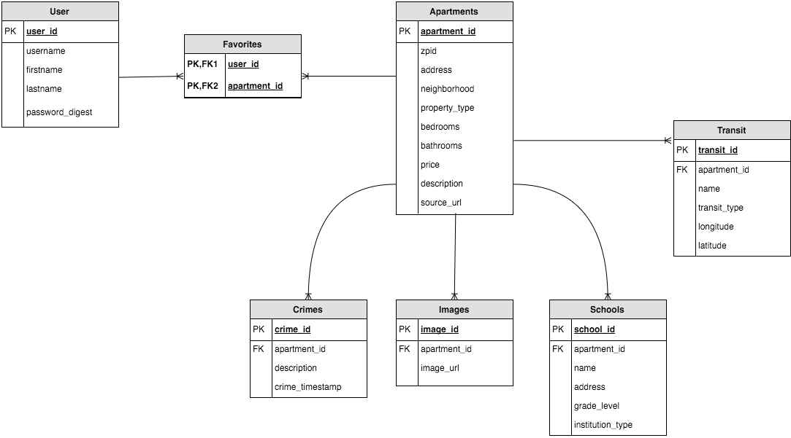
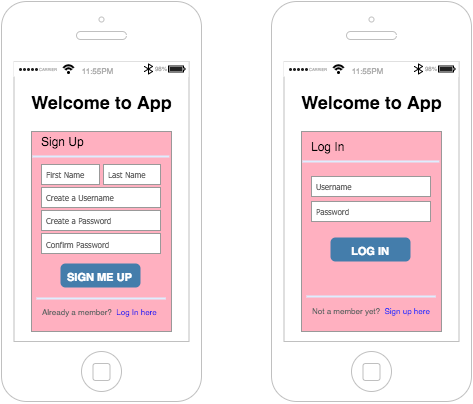
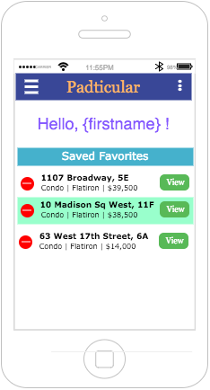
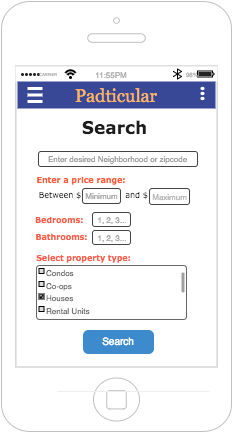
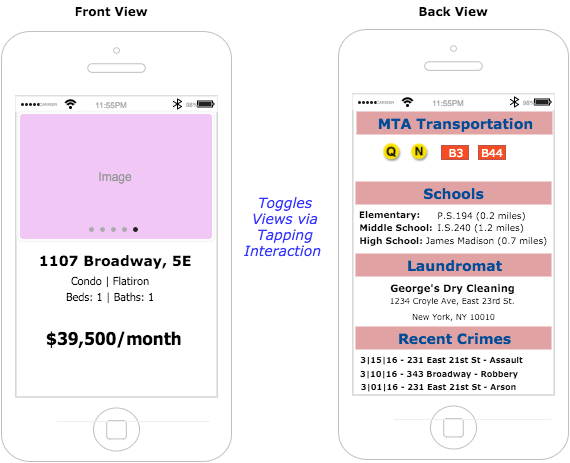
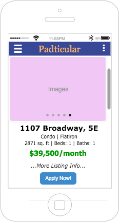

# Project #4: Padticular
GA-Bowie Final Project

<!-- # -->
#### Mission Statement
Experience the ease of apartment searching in NYC with just the swipe of a finger! 

---

#### Introduction
Apartment hunting has never been so easy! This mobile application provides a simplistic and interactive user experience in searching for apartments throughout New York City. This application answers all the major questions that play a crucial contributing factor in finding your ideal apartment such as: the nearest laundromat, MTA buses & trains, schools, _gyms, resturants, bars, parks_ and **the most recent crimes in the area**.

---

#### Technologies Used:
* React Native
* ~~HTML5 | CSS3~~
* JavaScript | jQuery
* Node.js
* Express.js
* PostgreSQL
* ~~AJAX~~

#### APIs Used:
* Streeteasy API
* ~~Zillow API~~
* Google Places API | Yelp API ???
* NYC Open Data Crimes
* ~~Twilio API~~

---
#### Installation Instructions (To be Added):
---

### User Story (v1.0.0):

#### Authentication ( Signup & Login )
* When app is loaded, it will check if a token already exists
    * **Token exists** - redirect to Homepage
    * **Token does not exist** - redirect to Signup
* Guest will be prompted to sign up or login before granted access to application
    * **Denied** access until guest inputs the correct and|or valid information
    * **Granted** access will redirect guest (user) to Homepage

#### Homepage
* Greets user with "Hello, {firstname}!"
* Display list of favorited apartments. Each iteration will have:
    * Address + Unit Number _(if available)_
    * Neighborhood
    * Property type
    * Price
    * View button (tap function?) - redirect to Profile
    * Delete button 
          * delete from database
          * update user's favorites list
* **Nav | Menu bar :**
    * **Home** - redirect to Homepage
    * **Find me a home** - redirect to Search page
    * **Log Out**
        * destroy token
        * redirect to Sign Up

#### Search Page
* **Nav | Menu bar**
* Display Search form with search filter features:
    * Select desired neighborhoods _(checkbox?)_
    * Affordable price range 
    * Desired number of bedrooms 
    * Desired number of bathrooms 
    * Select property type _(checkbox?)_
    * Search button
        * calls Streeteasy API 
        * redirect to YesOrNo Page

#### YesOrNo Page
* Display returned results via Streeteasy API **one at a time!**
* Toggle views when user taps on the listing
* **Front View:**
    * Images (user swipes left | right)
    * Address + unit number (if available)
    * Property Type | Neighborhood
    * Bedrooms | Bathrooms
    * Price
* **Back View:**
    * MTA Transportation:
        * Trains _(logo images?)_
        * Buses _(logo images?)_
    * Schools:
        * Elementary
        * Middle School
        * High School
    * Laundromat
    * Parks
    * Recent Crimes ( 5 most recent )
* **User can swipe:**
    * **Left** - if they're not interested
        * Render next listing from results
    * **Right** - if they want to save & look back on the listing later
        * Save listing to favorites table
        * Render next listing from results
    * **Up | Down** - if they want to discontinue search
        * Redirect to Homepage

#### Profile Page
* **Nav | Menu bar**
* Display all information about the listing
    * Images (user swipes left | right)
    * Price
    * Address + unit number _(if available)_ + city + state + zipcode
    * Property Type | Neighborhood
    * Sqft Size | Bedrooms | Bathrooms
    * MTA Transportation 
        * Trains _(logo images?)_
        * Buses _(logo images?)_
    * Schools
        * Elementary
        * Middle School
        * High School
    * Laundromat
    * Parks
    * Gyms
    * Resturants (top 3 most reviewed)
    * Bars (top 3 most reviewed)
    * Crimes (most recent 5)
    * Listing Description
    * Apply button - listing URL_link

---
#### Database Entity Relationship Diagram (ERD) v1.0.0
#

#### Signup | Login Wireframe
#

#### Homepage Wireframe
#

#### Search Page Wireframe
#

#### YesOrNo Page Wireframe
#

#### Profile Page Wireframe
#

---
### Routes
#### HTML (front-end) Routes ####

| CRUD | Route | Component |
| --- | ------ | ---------- |
| GET | / | Signup or Homepage |
| GET | /login | Login |
| GET | /signup | Signup |
| GET | /logout | Logout |
| GET | /home | Homepage |
| GET | /apartments | Apartment |

---
#### Users JSON Routes ####
| CRUD | Route | Auth Needed? | Description |
| --- | ------ | ------ | --- |
| GET | /users | NO | checks if token exists |
| POST | /users | NO |  adds new user to db |
| POST | /users/login | NO | logs in user & gets token | 

Request (POST /users/login)
```
{
  username: String,
  password: String
}
```

Request (POST /users):
```
{
  username: String,
  firstname: String,
  lastname: String,
  password: String
}
```

Response:
``` 
 {
   data: { token: String }
 }
```

Response (GET /users):
```
{
  data: [{
    user_id: Number, 
    username: String,
    firstname: String,
    lastname: String
  }]
}
```
---
#### Apartment (Cribs) JSON Routes ####
| CRUD | Route | Auth Needed? | Description |
| ---- | --- | ---- | ---- |
| GET | /apartments | YES | gets all user's favorited apartments |
| GET | /apartments/:id | YES | display an apartment profile |
| POST | /apartments | YES | adds apartment to Apartment & Favorite table |
| DELETE | /apartments/:id | YES | deletes apartment |

Request (POST /apartments):
```
{
  id: Number,
  address: String,
  address_unit: String,
  neighborhood: String,
  price: Decimal,
  beds: Number,
  baths: Number,
  description: Text,
  size_sqft: Number,
  img_url: [],
  apt_url: String
}
```
---
### Future Bonus Implementations (To be Added):
* **[Nav Bar|Menu]: Invite a Friend** 
    * User can invite a friend by entering:
        * Friend's Name
        * Friend's Phone Number
    * Friend will receive a text message (Twilio API) to join this awesome app
